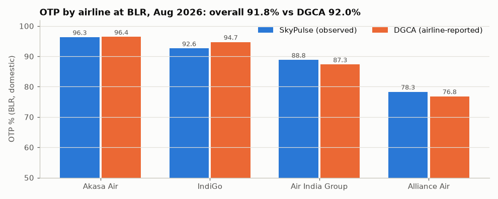
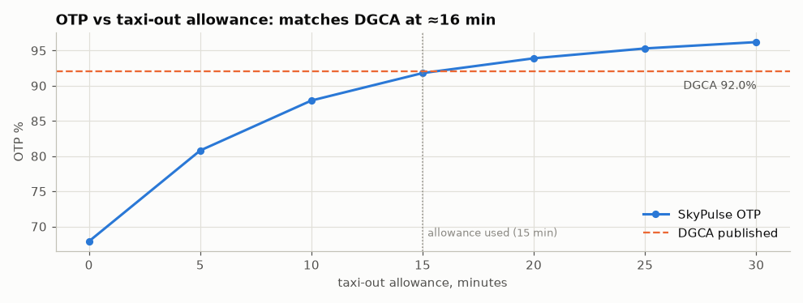
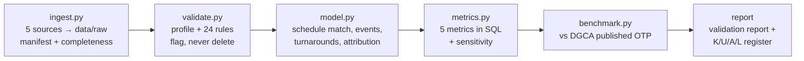

# SkyPulse: Ground-Delay Intelligence for Bengaluru Airport (BLR)

[](https://github.com/Abhinavsuri90/SkyPulse/actions/workflows/ci.yml)


A reproducible data pipeline that turns five public aviation data sources into one operational decision for Kempegowda International Airport: **is departure delay coming from the air or from the ground, and how does BLR compare with the regulator's published figures?**

> **Bottom line (August 2026).**
> - **91.6 %** of BLR departures left on time. On the regulator's like-for-like population SkyPulse measures **91.8 %** against DGCA's independently published **92.0 %**: a gap of 0.2 points, with an identical airline ranking.
> - **59 % of delayed departures were delayed on the ground.** In those cases the aircraft arrived in time and the weather was clear, yet it still left late.
> - **Recommendation:** fix the turnaround process before padding schedules; ground-side delay hits every large airline at a similar rate. Air India Group's lower on-time rate is a separate, inbound problem: mostly late-arriving aircraft.

Run the full pipeline and reproduce every number below, with no API keys and no network:

```bash
python src/pipeline.py --offline
```

CI runs the same check on every push.

---

## The problem

BLR's operations leadership can't see where departure delay builds up during a flight's time at the airport: in late inbound aircraft, in weather, or in the ground turnaround. They also have no independent reference to tell whether BLR's performance is normal. Without both, they can't choose between two expensive fixes.

| | |
|---|---|
| **Primary user** | Airport operations manager, who makes the investment decision |
| **Secondary user** | Airline liaison team, who take airline-specific findings to the airlines |
| **Project KPI** | **On-Time Departure Rate**: the share of departures leaving no more than 15 min after scheduled departure. This is the rule the regulator, DGCA, uses. |
| **Decision supported** | **Schedule padding**, if delay arrives with the aircraft or the weather, *or* **turnaround staffing / ground process**, if delay is added on the ground. Plus: is BLR in line with the regulator's published figures? |
| **Scope** | BLR departures and arrivals, August 2026, chosen to match DGCA's latest published month |

---

## Key results

| | August 2026 |
|---|---|
| **On-Time Departure Rate** (KPI) | **91.6 %** across 6,430 departures |
| Independent benchmark (DGCA, same month, airlines and rule) | 91.8 % vs 92.0 %, so a gap of **−0.2 pts** and an **identical airline ranking** |
| Delayed departures caused on the ground | **59 %** (319 of 539) |
| Inbound flights: median arrival vs schedule | **12.0 min early** |
| Share of hours with adverse weather | 38 of 744 (5 %) |
| Data processed | 20,549 flight legs from 5 sources, checked by 24 validation rules and 23 automated tests |

### The five metrics

Delay metrics count the **6,430 of 10,157 observed departures** that have a real schedule match and pass every validation rule. The rest are flagged, not deleted; the reasons are in [`output/validation_report.md`](output/validation_report.md).

| # | Metric | Result | Sample | Definition |
|---|---|---|---|---|
| 1 | **On-Time Departure Rate** (KPI) | **91.6 %** | 6,430 departures | Estimated off-block ≤ scheduled departure + 15 min (the DGCA rule) |
| 2 | Average departure delay | +0.3 min (median −4.6) | 6,430 departures | Estimated off-block − scheduled departure. The 539 delayed flights average 60.0 min late. |
| 3 | Average arrival delay | −3.4 min (median −12.0) | 5,966 arrivals | Estimated in-block − scheduled arrival. 89.0 % arrive within 15 min. |
| 4 | Median aircraft turnaround | 107.6 min runway-to-runway | 9,276 turns | Same aircraft (`icao24`): BLR landing → next BLR take-off, kept within 20 min–12 h. That is about 85 min gate-to-gate against a scheduled 75 min. |
| 5 | Weather-impacted delay rate | 17.8 % | 539 delayed departures | Delayed departures with an adverse-weather hour between scheduled departure − 1 h and departure |

Full table with interpretation: [`output/evidence_table.md`](output/evidence_table.md)

### Independent validation against the regulator

DGCA (India's Directorate General of Civil Aviation) publishes a monthly on-time figure for BLR, compiled from what the airlines report. SkyPulse measures the same thing from radar observations. **The DGCA figure is never used as an input; it is only the number we test ourselves against.**

Population: BLR domestic departures of the five airline groups DGCA reports on (n = 5,738), August 2026, >15-minute rule.

| Airline group | SkyPulse (observed) | DGCA (airline-reported) | Gap |
|---|---|---|---|
| Akasa Air | 96.3 % | 96.4 % | −0.1 pts |
| IndiGo | 92.6 % | 94.7 % | −2.1 pts |
| Air India Group | 88.8 % | 87.3 % | +1.5 pts |
| Alliance Air (n = 69) | 78.3 % | 76.8 % | +1.5 pts |
| **BLR overall** | **91.8 %** | **92.0 %** | **−0.2 pts** |



Two independent methods put the airlines in the same order, and agree on the overall level to within 0.2 points. The level still depends on the one assumption public data can't measure, **taxi-out time**:
- OpenSky sees wheels-up; DGCA counts pushback from the gate.
- A taxi allowance of 16 min would close the gap.
- We report that as a diagnostic, keep the planned 15 min, and **deliberately do not tune to the benchmark**.

SpiceJet (DGCA: 18.2 % at BLR) made only 32 BLR departures in August and has no schedule in our sample, so it is out of scope. Full comparison: [`output/benchmark_comparison.md`](output/benchmark_comparison.md)

### Where the delay comes from

Each of the 539 delayed departures is attributed in DGCA's order of precedence, reactionary first:

| Cause | Delayed departures | Share | Test applied |
|---|---|---|---|
| **Ground-side / other** | 319 | **59.2 %** | Aircraft at the gate in time, clear weather, still left > 15 min late |
| Reactionary (inbound late) | 153 | 28.4 % | Inbound aircraft reached the gate too late for even a 30-min turn |
| Weather-exposed | 67 | 12.4 % | Adverse weather hour in the departure window |

**Robustness:** the one unmeasurable input is the taxi-out allowance, so the analysis is rerun across its whole plausible range.

| Taxi-out allowance | 0 min | 5 min | 10 min | **15 min** | 20 min | 25 min |
|---|---|---|---|---|---|---|
| On-Time Departure Rate | 67.2 % | 80.2 % | 87.6 % | **91.6 %** | 93.7 % | 95.0 % |
| Ground-side share of delay | 81 % | 75 % | 68 % | **59 %** | 53 % | 44 % |
| Reactionary share of delay | 7 % | 12 % | 19 % | **28 %** | 38 % | 48 % |

Ground-side is the largest cause for every allowance **up to 20 min**; at 25 min, reactionary overtakes it. The airline ranking holds for every allowance of 10 min or more. **The recommendation therefore holds for any taxi-out between 10 and 20 min**, and the allowance that reproduces DGCA's published figure, 16 min, sits inside that window.



---

## Recommendation

**For:** the BLR operations manager (the decision-maker) and the airline liaison team (who carry the conversation to the airlines).

1. **Invest in the turnaround process before schedule padding.**
   - 59 % of delay is added on the ground.
   - Inbound flights reach the gate a median 12.0 min early, so most aircraft are available in time.
   - Turnarounds run a median of about 9 min over their scheduled ground time.
2. **Treat Air India Group's gap as an inbound problem, not a turnaround one.** At the same airport, in the same weather, on-time rates differ sharply (DGCA's own BLR figures show the same gap). Rates per departure show why:

   | Airline group | On-time rate | Departures | Ground-side delays per 100 departures | Reactionary delays per 100 departures | Inbound flights > 15 min late |
   |---|---|---|---|---|---|
   | Akasa Air | 95.3 % | 464 | 4.1 | 0.4 | 11 % |
   | IndiGo | 92.9 % | 4,187 | 4.5 | 1.3 | 7 % |
   | Air India Group | 88.5 % | 1,509 | 5.4 | **5.2** | **15 %** |

   - Ground-side delay is similar for all three, so the turnaround work in point 1 is airport-wide. IndiGo alone has 190 of the 319 ground-side cases.
   - Air India Group's gap is late-arriving aircraft: four times IndiGo's reactionary rate, and twice its share of late inbound flights.
   - So the liaison team's conversation with Air India Group is about inbound punctuality and buffers on its late-running rotations, not BLR ground staff.
3. **Don't pad schedules for weather in the monsoon months.** Only 38 of 744 hours were adverse, and weather-exposed delays are 12 % of the total.

**Where this could be wrong.** DGCA's *national* delay-cause split is 65 % reactionary, against our 28 % at BLR. Our test is stricter: the aircraft must have been physically unable to make its departure. The national figure is also weighted toward the most congested hubs, Delhi and Mumbai. The recommendation would also flip if BLR's typical taxi-out were longer than 20 min. **Next step:** request BLR-only delay codes for August from IndiGo and Air India Group, which would confirm or overturn the recommendation.

---

## Data sources

Five sources are used, across four retrieval modes: REST APIs, a CSV file, an official PDF report, and SQL over the derived model.

| # | Source | Mode | Volume retrieved | Role in the pipeline |
|---|---|---|---|---|
| 1 | [OpenSky Network](https://opensky-network.org) flights API | REST, OAuth2 | 20,549 BLR flight legs (62 day files) | Actual take-off/landing times, aircraft identity |
| 2 | [AviationStack](https://aviationstack.com) flights API | REST, API key | 22 of 100 free calls → 1,486 rows → 634 flight schedules | Scheduled departure/arrival times |
| 3 | [Open-Meteo](https://open-meteo.com) historical API | REST | 744 hourly records | Adverse-weather hours at BLR |
| 4 | [OurAirports](https://ourairports.com/data/) `airports.csv` | CSV file | 86,119 airports | Airport codes, country (domestic?), coordinates |
| 5 | [DGCA](https://www.dgca.gov.in) monthly traffic report | Official PDF | 61 published OTP values | Independent benchmark |
| - | SkyPulse model (`data/processed/skypulse.sqlite`) | SQL | Entity/event tables | Every metric is SQL over this model |

Owner, grain, join keys, completeness checks and known gaps for each source: [`diagrams/source_map.md`](diagrams/source_map.md)

---

## How it works



| Stage | What it does | Main output |
|---|---|---|
| [`ingest.py`](src/ingest.py) | Pulls each source, preserves raw files as received, and records URL, row count and sha256 for each. Proves completeness per day, per API page and per hour. | `data/raw/`, `data/raw/_manifest.json` |
| [`validate.py`](src/validate.py) | Profiles every source and applies 24 business rules. Rows are **flagged, never deleted**. | `output/validation_report.md` |
| [`model.py`](src/model.py) | Matches legs to schedules, builds the event log, pairs turnarounds by aircraft and attributes each delay. Asserts that raw legs equal modelled legs. | SQLite entity/event model |
| [`metrics.py`](src/metrics.py) | Computes the five metrics in SQL (with a cross-check in pandas), plus the sensitivity analysis | `output/evidence_table.md` |
| [`benchmark.py`](src/benchmark.py) | Parses the DGCA PDF, validates the parse, and compares like with like | `output/benchmark_comparison.md` |
| [`pipeline.py`](src/pipeline.py) | Runs everything in order, with logging, retries, offline mode and a failure drill | `output/run_status.json` |

The workflow model (states, events, interventions) and the entity-relationship diagram are in [`diagrams/workflow_model.md`](diagrams/workflow_model.md).

---

## Data quality: what the raw data got wrong

Every issue below was found by profiling or cross-checking, fixed by a named rule, and measured for impact. None was patched silently.

| Issue found | Evidence | Handling | Impact if ignored |
|---|---|---|---|
| AviationStack labels local IST times as UTC | Across 483 matched flights, the median difference is +1.4 min for departures and −1.6 min for arrivals when read as IST, but 329 min when read as UTC | Re-read as local time (V-AS-4); re-proven on every run | Every delay 5.5 h wrong |
| Aircraft IDs in different case (`8017F2` vs `8017f2`) | 958 rows | Normalised to lowercase (V-AS-3) | Most aircraft joins silently lost |
| Codeshare duplicates | 339 of 1,486 schedule rows | Excluded (V-AS-1) | Flights double-counted |
| Callsign ≠ flight number (e.g. `AIC7JN` operates flight `AIC2810`) | Only 43.8 % of departures match directly | Callsign mapping learned from 489 aircraft-and-time matches, raising coverage to **76.7 %**. Tested on August data it never saw: 94.7 % destination agreement vs 94.2 % for direct matches. | More than half of flights (56 %) unmeasurable |
| Flights retimed after August | 20 flight codes, 429 legs: 15 run 1.1–11.1 h "late" every day; 4 run a steady 40–58 min "late" yet were on time in the September sample; 1 runs early | Flagged as schedule changes, not delays (V-DR-5) | OTP understated at 88.2 % instead of 91.6 %, and Air India Group blamed for delays it did not have |
| OpenSky merges round trips into BLR → BLR legs | 523 legs | Take-off kept; landing excluded from arrival delay (V-OS-7) | Arrivals scored against the wrong flight |
| A defect in DGCA's own report | Alliance Air chart lists Guwahati twice (92.0 and 63.5) | Both values flagged and unused (V-DG-4) | Wrong benchmark value |
| Gust threshold describes the climate, not adverse weather | 40 km/h gusts fired on 265 of 744 hours | Raised to 55 km/h **before** delays were examined (A-5) | Weather blamed for most delays |

Rule-by-rule counts: [`output/validation_report.md`](output/validation_report.md). Every assumption and limitation, each with an ID: [`docs/known_unknown_assumptions.md`](docs/known_unknown_assumptions.md)

---

## Reproducibility and dependability

| Guarantee | How it is enforced |
|---|---|
| Reproducible from raw inputs | The raw snapshot is committed. `--offline` forbids all network calls. CI checks that regenerated numbers equal the committed ones. |
| Rerun-safe | Raw files are reused. The SQLite model is rebuilt from scratch each run. Outputs are written atomically. |
| Fails loudly, never silently | Every external call retries 3 times with backoff, then stops the run. A failed run writes `LAST_RUN_FAILED.md` and changes no outputs. |
| No silent data loss | Row counts are logged at every stage. The model asserts 20,549 raw legs = 20,549 modelled legs. OTP is computed in both SQL and pandas and must agree. |
| API budget cannot be overspent | A persistent ledger records each AviationStack call before it is made and refuses call 31 (22 used). |
| Secrets stay secret | Keys live in a git-ignored `.env`, and error messages are scrubbed of credentials. There's a test for it. |

Evidence of a deliberate failure drill and two byte-identical reruns: [`docs/run_evidence.md`](docs/run_evidence.md)

---

## Setup and run

```bash
git clone https://github.com/Abhinavsuri90/SkyPulse.git && cd SkyPulse
python3 -m venv .venv && source .venv/bin/activate
pip install -r requirements.txt

python src/pipeline.py --offline   # rebuild every output from the committed raw data
pytest -q                          # 23 tests
```

Open [`notebooks/01_explore.ipynb`](notebooks/01_explore.ipynb) after running the pipeline. It is the investigation trail behind each rule.

<details>
<summary><b>Re-pulling live data (optional)</b></summary>

Copy `.env.example` to `.env` and add an OpenSky API client and an AviationStack key. Then:

```bash
python src/pipeline.py                          # fetch anything missing, reuse the rest
python src/pipeline.py --refresh weather,dgca   # re-download chosen sources
python src/ingest.py --aviationstack-calls 5    # spend AviationStack budget explicitly (ledger-capped at 30)
python src/pipeline.py --fault weather          # failure drill: must fail loudly and change nothing
```

To change scope, edit [`config.yaml`](config.yaml): airport, window, thresholds and the airline map all live there. A new airport or month also needs a fresh ingest and a new AviationStack sample.

</details>

---

## Repository layout

```
config.yaml                 scope and thresholds: the single source of truth
src/                        ingest, validate, model, metrics, benchmark, pipeline, common
diagrams/                   source_map.md, workflow_model.md (Mermaid)
data/raw/                   every source exactly as retrieved + _manifest.json
data/processed/             derived tables and JSON (SQLite is rebuilt each run, git-ignored)
output/                     evidence_table.md, benchmark_comparison.md, validation_report.md, figures/
docs/                       known_unknown_assumptions.md, run_evidence.md
notebooks/01_explore.ipynb  investigation trail with charts
tests/                      23 pytest checks
.github/workflows/ci.yml    CI: tests + offline pipeline + reproducibility check
```

---

## Assumptions and limitations

| ID | What | Effect |
|---|---|---|
| A-2 | Gate time = radar time ∓ taxi allowance (15 min out, 8 min in); public data can't measure it | Moves the OTP *level*; the decision holds for allowances of 10–20 min (DGCA's figure implies 16) |
| A-3 | Schedules sampled in September (22–23 Sep) are applied to August (same IATA summer season) | Retimes are detected and excluded (V-DR-5) |
| L-3 | The DGCA benchmark is airline self-reported and covers domestic flights only | The comparison is restricted to that same population |
| L-4 | Weather is modelled (Open-Meteo), not observed (METAR) | Short storms can be mistimed by up to an hour |
| L-6 | 23 % of the five groups' departures have no schedule match | They count in traffic and turnarounds, not in delay KPIs |
| L-5 | One month of data, during the monsoon | A winter-fog analysis needs a rerun (two dates in `config.yaml`) |

Complete register: [`docs/known_unknown_assumptions.md`](docs/known_unknown_assumptions.md)

**In production:** with the airport's own operations feed (AODB / A-CDM), sources 1–2 and assumptions A-2 and A-3 disappear. Only `ingest.py` would change.

---

## Rubric evidence map

| Category (20 % each) | Evidence |
|---|---|
| **Source reasoning** | [`diagrams/source_map.md`](diagrams/source_map.md): business question → information → source, with owner, grain, join keys and gaps. Scope rationale is in [`config.yaml`](config.yaml). |
| **Retrieval** | [`src/ingest.py`](src/ingest.py) covers 4 retrieval modes. Completeness is proven by [`_manifest.json`](data/raw/_manifest.json), [`opensky_daily_counts.csv`](data/processed/opensky_daily_counts.csv) and the [AviationStack call ledger](data/raw/aviationstack/_call_ledger.json). Raw inputs are preserved as received. |
| **Validation** | [`src/validate.py`](src/validate.py) (24 rules that flag and never delete), [`validation_report.md`](output/validation_report.md), [`known_unknown_assumptions.md`](docs/known_unknown_assumptions.md) (also summarised in the evidence table's brief K/U/A/L section), the independent DGCA benchmark in [`benchmark_comparison.md`](output/benchmark_comparison.md), and [`tests/`](tests/test_validate.py) |
| **Workflow + metrics** | [`diagrams/workflow_model.md`](diagrams/workflow_model.md), [`src/model.py`](src/model.py), [`src/metrics.py`](src/metrics.py), [`evidence_table.md`](output/evidence_table.md) |
| **Pipeline dependability** | [`src/pipeline.py`](src/pipeline.py), [`docs/run_evidence.md`](docs/run_evidence.md), [CI workflow](.github/workflows/ci.yml) |
