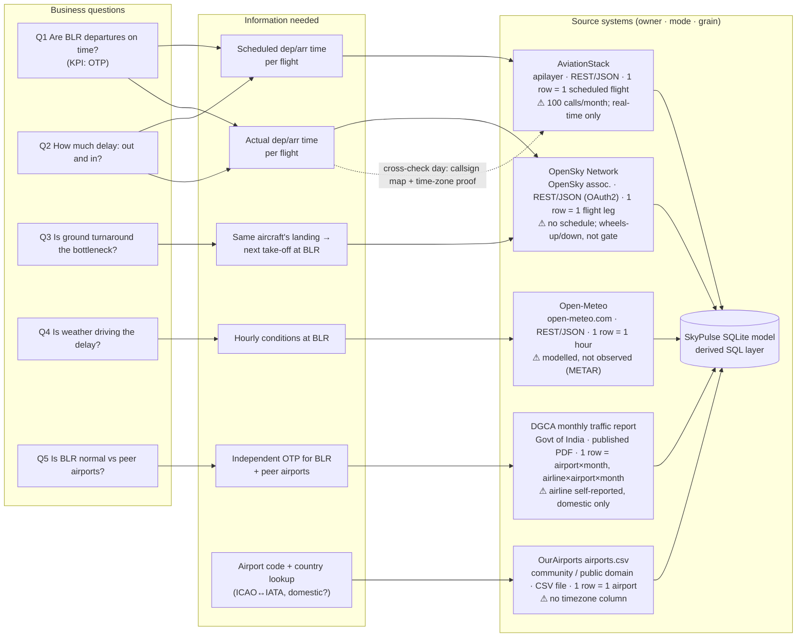

# Source map: business question → information needed → source system

**Client:** BLR (Kempegowda International Airport) operations leadership.
**KPI:** On-Time Departure Rate (DGCA definition: departed ≤ 15 min after scheduled departure).
**Decision:** Pad schedules (the problem is inbound/weather) *or* staff turnarounds (the problem is on the ground)? And is BLR worse than its peers?

## Source inventory

| # | Source | Owner / authority | Retrieval mode | Grain | Key fields used | Join key | Window pulled | How completeness is proven |
|---|---|---|---|---|---|---|---|---|
| 1 | OpenSky Network `/flights/departure`, `/flights/arrival` for `VOBL` | OpenSky Network Association (non-profit, crowd-sourced ADS-B receivers) | REST API, JSON, OAuth2 client-credentials | 1 row = 1 observed flight leg | `icao24`, `callsign`, `firstSeen`, `lastSeen`, `estDepartureAirport`, `estArrivalAirport`, `est*HorizDistance/VertDistance` | `icao24` (aircraft), `callsign` = flight ICAO code | Aug 1–31 2026, one request per IST day per direction (62 files) | Per-day row count vs. absolute floor and vs. 70% of window median; empty/404 days logged as `empty`, never dropped |
| 2 | AviationStack `/v1/flights` (`dep_iata=BLR`, `arr_iata=BLR`) | apilayer (commercial) | REST API, JSON, access key | 1 row = 1 scheduled flight (incl. codeshare duplicates) | `flight.icao`, `departure.scheduled/actual/actual_runway`, `arrival.scheduled/actual_runway`, `aircraft.icao24`, `flight_status`, `codeshared` | `flight.icao` ↔ OpenSky `callsign`; `aircraft.icao24` ↔ `icao24` | Real-time snapshots only (free tier has no history), ≤ 30 calls × 100 rows | `pagination.total` vs rows retrieved; every call in `_call_ledger.json` |
| 3 | Open-Meteo historical-forecast API | open-meteo.com (open source; models from national weather services) | REST API, JSON, no key | 1 row = 1 hour at BLR coordinates | `precipitation`, `wind_gusts_10m`, `visibility`, `weather_code` | local hour (IST) | Aug 1–31 2026 | Exactly 24 × 31 = 744 hours expected; any shortfall stops the pipeline |
| 4 | OurAirports `airports.csv` | Community-maintained, public domain | CSV file download | 1 row = 1 airport | `ident`, `icao_code`, `iata_code`, `iso_country`, `type`, lat/lon | ICAO code ↔ OpenSky `estArrivalAirport` / `estDepartureAirport` | Full file (~86k airports) | Row floor (≥ 50,000) and `VOBL` must be present |
| 5 | DGCA monthly *Traffic Data* report (On-Time Performance pages) | Directorate General of Civil Aviation, Govt. of India. Figures are **self-reported by airlines** | Official published PDF, found through DGCA's portal listing service and downloaded from DGCA's public file host | 1 value = airport × month (all 5 airline groups); airline group × airport × month; national delay-cause % | BLR OTP %, airline-wise BLR OTP %, delay-reason split | airport IATA (`BLR`) + month; airline group | August 2026 report (published 2026-09-23) | File must be a PDF and contain an "On-Time Performance" section; BLR value must parse to 0–100 |
| — | SkyPulse SQLite model (`data/processed/skypulse.sqlite`) | Us (derived) | SQL | entity / event tables | see `workflow_model.md` | — | — | Row counts logged at every stage; reconciliation raw → model |

## Gaps: what each source cannot tell us, and what we do about it

| Gap | Consequence | Mitigation (and where it is written down) |
|---|---|---|
| **OpenSky has no scheduled time.** It only records when the transponder was seen. | Cannot compute a delay from OpenSky alone. | Scheduled times come from AviationStack, matched by flight code or a learned callsign mapping. The share of flights with a real schedule is reported next to every metric. |
| **OpenSky `firstSeen` / `lastSeen` are wheels-up / wheels-down, not gate times.** Schedules and DGCA use gate (off-block) times. | Raw delay would be overstated by the taxi-out time. | The plan was to measure taxi time from AviationStack. That failed: its `actual` is itself runway time (K-8). So a fixed allowance is used (A-2), with OTP reported across 0–25 min and the decision shown not to depend on it. |
| **AviationStack free tier: 100 calls/month, real-time only, no historical endpoint.** | Cannot look up August schedules directly. | 22 of the 30 allowed calls (ledger-enforced). Filtering by the 5 airline groups avoids pages like call 1, where 74 of 100 rows were codeshare duplicates. The result is a full day of schedules: 691 departures and 695 arrivals, applied to August under the same summer schedule (A-3). Flights retimed since August are detected and excluded (V-DR-5). |
| **OurAirports has no timezone column** (the project brief assumed it did). | Can't localise timestamps from this file. | India uses one zone (IST, UTC+05:30, no DST), so it's fixed in `config.yaml`. Known K-3. |
| **Open-Meteo is modelled weather, not an observation.** | A short, local thunderstorm may be missed or mistimed. | Accepted for a monthly view. Adverse-weather thresholds are explicit in config. Observed METAR is the documented upgrade. Limitation L-4. |
| **DGCA OTP is self-reported by airlines and covers only 5 domestic airline groups.** | Not directly comparable to "all BLR departures". | The benchmark compares like with like: same month, domestic departures, same 5 groups, same 15-min rule. Remaining differences are explained in `output/benchmark_comparison.md`. |
| **Callsign ≠ flight number for Indian carriers** (alphanumeric ATC callsigns, e.g. `AIC7JN` = flight `AIC2810`). | Only 44 % of departures match a schedule directly. | OpenSky is pulled for the AviationStack sample day too. Matching the same aircraft (`icao24`) at the same time teaches a callsign → flight mapping, which lifts coverage to 77 % and is validated out of sample (K-11). The rest are flagged, not guessed (V-DR-1). |
| **AviationStack mislabels local times as UTC and sends `icao24` in UPPERCASE.** | A naive join would be 5.5 h off, and a case-sensitive join silently loses most matches. | Both normalised in `validate.py` (V-AS-3, V-AS-4) and proven by the cross-check (K-7). |
| **OpenSky loses 43 % of departures before destination; merges some round trips into BLR→BLR legs.** | Domestic/international unknown; wrong callsign on the inbound end. | Destination falls back to the schedule's. Merged round trips are flagged (V-OS-7). |

## If this ran against the real client

At a real engagement, sources 1 and 2 would be replaced by BLR's own **AODB / A-CDM feed**, which records scheduled, off-block and take-off times for every movement. That removes the taxi-time and schedule-matching assumptions. The pipeline's stages, validation rules and metrics stay the same; only `ingest.py` changes.
