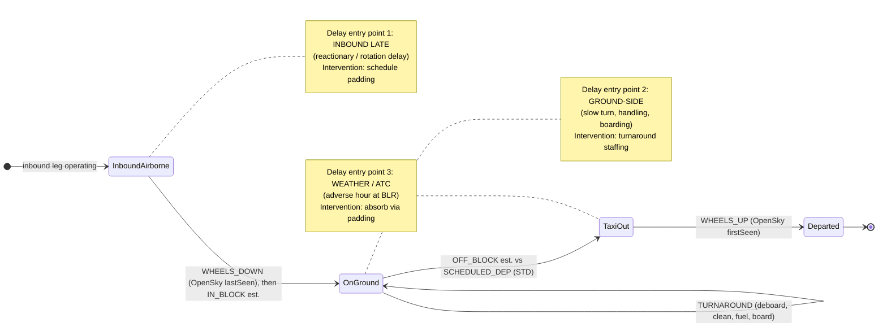
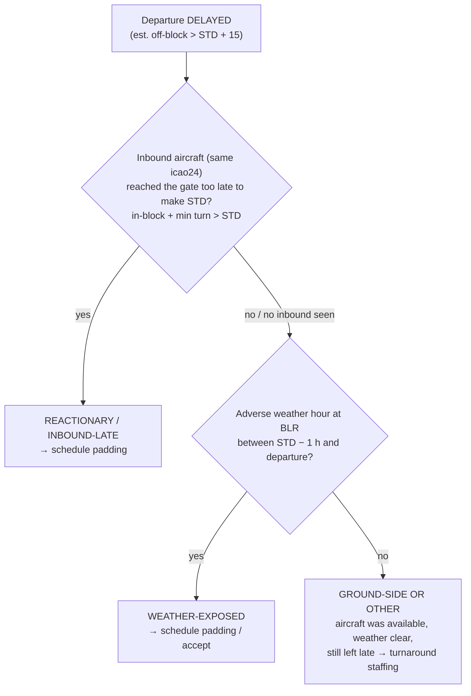
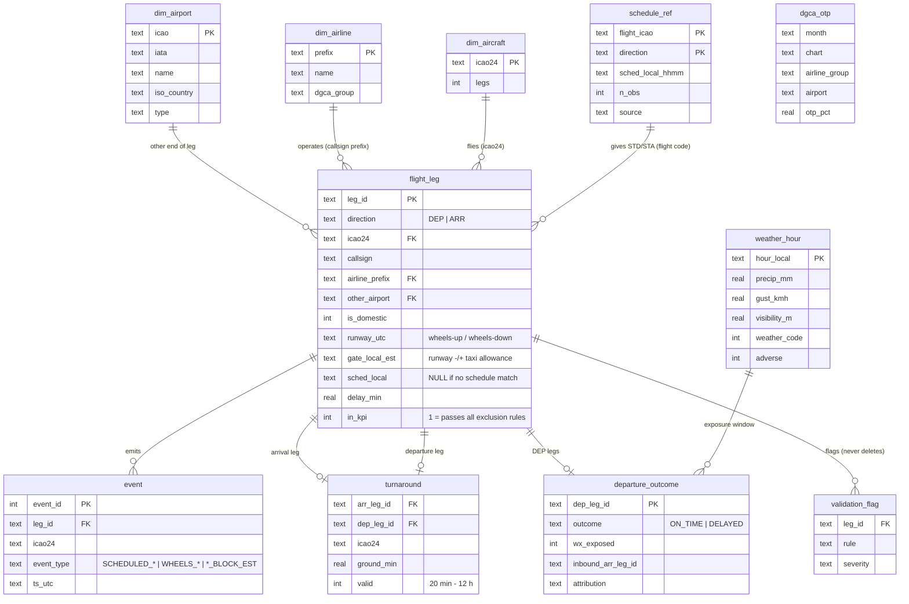

# Workflow model: entities, events, states, interventions, outcomes

## 1. The operational workflow being modelled

One aircraft's visit to BLR is the unit of work. It arrives on an inbound leg, is turned on the ground, and leaves on an outbound leg. Delay can enter at three points, and each one maps to a different intervention:

**Outcome** for every departure: `ON_TIME` (off-block ≤ STD + 15 min) or `DELAYED` (the DGCA rule).
**Attribution** for every *delayed* departure, applied in DGCA's precedence (reactionary first):

The decision in the brief follows from the attribution split. If reactionary and weather-exposed delays dominate, pad the schedule. If ground-side dominates, staff the turnaround. This is **our inference** (U-4 in `docs/known_unknown_assumptions.md`). It is cross-checked against DGCA's national delay-cause split (K-6), which puts reactionary at 65 %.

## 2. Relational / event model (SQLite, built by `src/model.py`)

**Grain rules:**
- `flight_leg`: one row per OpenSky-observed movement *at BLR*. A departure and the next airport's arrival of the same flight are different legs, because only the BLR end is in scope.
- `event`: one row per timestamped lifecycle event. It is what lets us replay any aircraft's day at BLR in order.
- `validation_flag` holds every rule hit. `flight_leg.in_kpi` is derived from it, so a flagged row is excluded from the metrics yet stays queryable.

## 3. How the five metrics map to the model

| # | Metric | Computed from | Tied to KPI because |
|---|---|---|---|
| 1 | **On-Time Departure Rate** (KPI) | `departure_outcome.outcome` for `flight_leg.in_kpi = 1` | It *is* the KPI |
| 2 | Average departure delay | `flight_leg.delay_min`, DEP | Severity behind the OTP rate: a 70 % OTP with 16-min delays ≠ 70 % with 90-min delays |
| 3 | Average arrival delay | `flight_leg.delay_min`, ARR | Late arrivals feed reactionary departure delay (entry point 1) |
| 4 | Median aircraft turnaround | `turnaround.ground_min` where `valid = 1` | Ground time is where entry point 2 lives |
| 5 | Weather-impacted delay rate | `departure_outcome.wx_exposed` among delayed departures | Size of entry point 3 |
